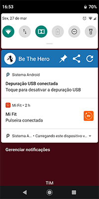

# Semana OmniStack 11.0 - RocketSeat
## App Mobile

### Screenshots
    

### Informações
```
-- instalar expo-cli, de forma global
npm install -g expo-cli

-- problemas comuns
https://github.com/Rocketseat/expo-common-issues

-- verificar se está funcionando
expo -h

-- iniciar um novo projeto (escolher template blank)
expo init mobile

-- start no projeto
yarn start
```

### Erros no Expo
* Se executar pelo emulador, e der erro de IP, mude para "Connection []Tunnel []LAN [X]Local".
* Erro de versão do Expo pode ocorrer, baixei manualmente o APK do Google Play e instalei arrastando para o emulador.

### Para utilizar via rede, setar a variável:
```
-- setar
set REACT_NATIVE_PACKAGER_HOSTNAME='192.168.15.13'
-- ou
export REACT_NATIVE_PACKAGER_HOSTNAME='192.168.15.13'

-- para Windows, executar em linha de comando, como administrador
-- pode também setar via "Painel de Controle", em variáveis do sistema
setx /M REACT_NATIVE_PACKAGER_HOSTNAME '192.168.15.13'

-- verificar
echo $REACT_NATIVE_PACKAGER_HOSTNAME
```

### Emulador / Celular
* no emulador CTRL+M abrir menu (Android)
* no celular, chacoalhar abre o menu

### ATUALIZAR SDK
```
expo update 36.0.0
```
